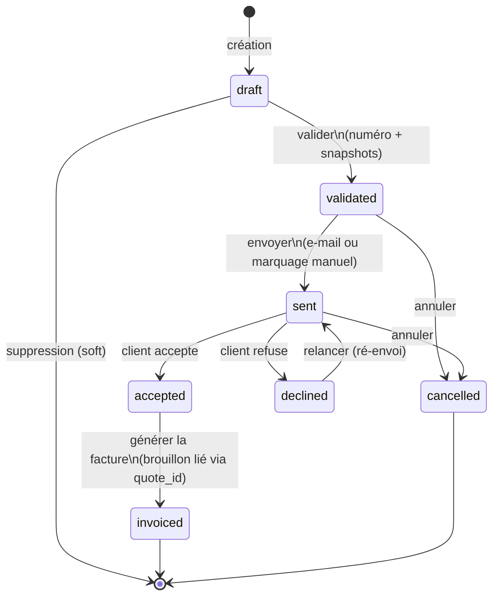
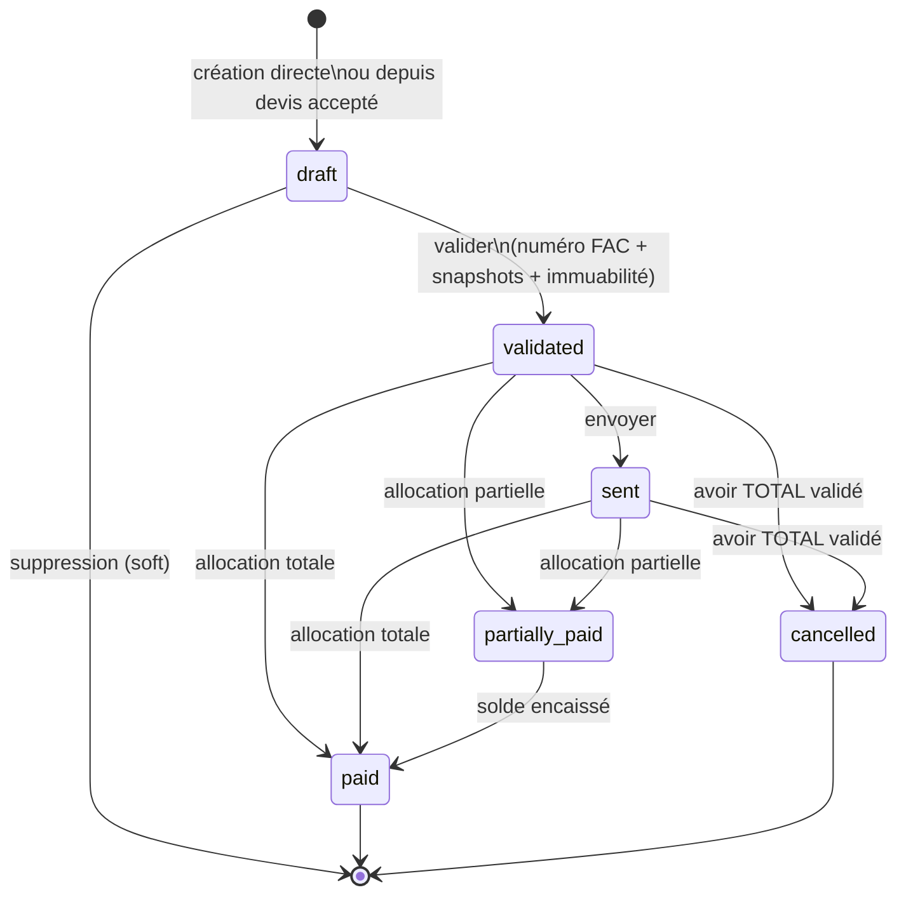
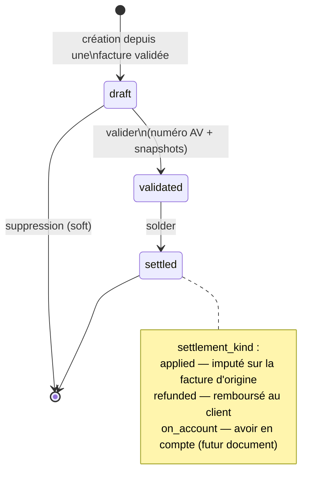
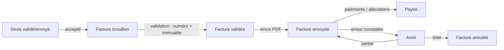

# Machine à états des documents commerciaux

> Livrable 3. Ces transitions sont **les seules autorisées** ; elles seront
> implémentées dans des Actions dédiées (une transition = une Action = une
> transaction DB), vérifiées par les Policies, et verrouillées en base par les
> triggers d'immuabilité (`02-schema-phase-1.sql`).

## Principes transverses

- **Un statut stocké = un fait**, jamais une situation calculable. « En retard »
  (facture) et « expiré » (devis) sont **dérivés** (`due_date` / `valid_until`
  vs aujourd'hui) : pas de job de bascule, pas d'état incohérent.
- Toute transition écrit une entrée `audit_logs` (ancien état, nouvel état,
  utilisateur, horodatage) et émet un événement Laravel (`InvoiceValidated`, …).
- La **validation** est la transition pivot : numéro attribué (verrou sur
  `sequences`), snapshots vendeur/acheteur figés, taux TVA copiés sur les
  lignes — le tout dans **une seule transaction**. La génération du PDF et
  l'archivage dans `files` partent en job **après commit** (un échec de PDF ne
  doit ni bloquer ni faire sauter un numéro).
- Un **brouillon** est librement modifiable et soft-suppressible. C'est le seul
  état où c'est vrai.

---

## 1. Devis

| Transition | Conditions | Effets |
|---|---|---|
| `draft → validated` | ≥ 1 ligne ; client valide ; exercice ouvert couvrant `issue_date` | numéro `DEV-…`, snapshots, totaux figés |
| `validated → sent` | — | `sent_at`, job e-mail + PDF |
| `sent → accepted` | possible même après `valid_until` (avertissement UI, décision commerciale) | `decided_at` |
| `sent → declined` | — | `decided_at` |
| `accepted → invoiced` | aucune facture non-annulée déjà liée | crée une **facture brouillon** copiée du devis (`invoices.quote_id`) |
| `validated/sent → cancelled` | pas encore accepté | trace d'audit |

**« Expiré »** : affiché si `valid_until < today` et statut ∈ {validated, sent}.
Dérivé, jamais stocké.

---

## 2. Facture

| Transition | Conditions | Effets |
|---|---|---|
| `draft → validated` | ≥ 1 ligne ; exercice ouvert ; client avec ICE si personne morale ; totaux recalculés côté serveur | numéro `FAC-…` (séquence verrouillée, même transaction), snapshots, **immuabilité activée** ; PDF + archivage en job post-commit |
| `validated/sent → partially_paid` | `0 < amount_paid < total_ttc − withholding_amount` | mise à jour `amount_paid` via allocations |
| `→ paid` | `amount_paid = total_ttc − withholding_amount` | `paid_at` |
| `validated/sent → cancelled` | **avoir total validé** rattaché ; aucun paiement alloué non remboursé | `cancelled_at` ; la facture reste consultable et numérotée (jamais de DELETE) |

Interdits structurels : retour en `draft` après validation ; annulation d'une
facture payée sans remboursement préalable (l'avoir `refunded` doit précéder) ;
toute modification de contenu hors brouillon (trigger DB).

**« En retard »** : `due_date < today` et statut ∈ {validated, sent, partially_paid}.
Dérivé (index partiel `invoices_unpaid_due_idx` pour le dashboard et les relances).

---

## 3. Avoir (note de crédit)

| Transition | Conditions | Effets |
|---|---|---|
| création | facture d'origine ∈ {validated, sent, partially_paid, paid, cancelled*} ; lignes bornées par ce qui n'a pas déjà été avoiré (Σ avoirs ≤ facture, par ligne et au total) | `invoice_id` obligatoire, motif (`reason`) obligatoire |
| `draft → validated` | ≥ 1 ligne ; exercice ouvert ; motif renseigné | numéro `AV-…`, snapshots, immuabilité |
| `validated → settled` | `settlement_kind` choisi ; si `refunded` : remboursement saisi | `settled_at` ; si l'avoir est total → la facture d'origine peut passer `cancelled` |

\* un avoir sur facture `cancelled` n'existe que dans le flux d'annulation lui-même.

---

## 4. Enchaînement type (le parcours nominal Phase 1)

