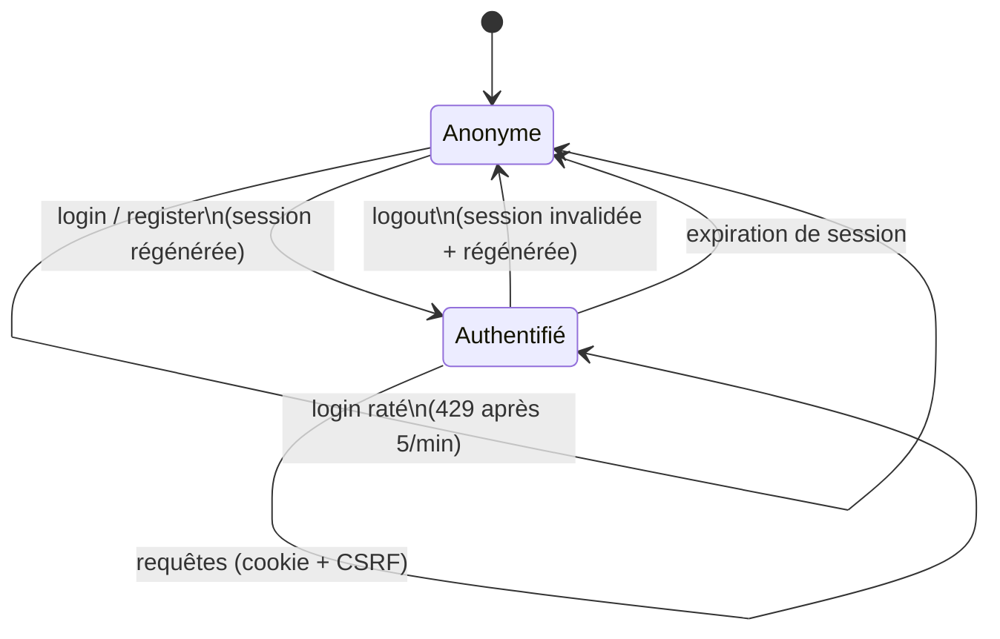
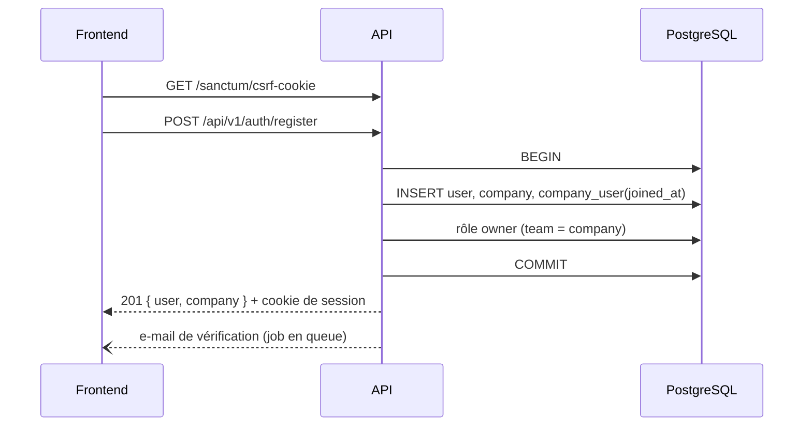

# Module Authentication — Analyse fonctionnelle

> Statut : **analyse validée le 2026-07-19** (arbitrages Q1–Q4 : non-bloquant /
> forme juridique demandée / 30 jours / détection navigateur + bascule visible).
> **Backend implémenté et testé** (28 tests, PHPStan niv. 8, Pint). Ajout validé :
> vat_exempt automatique pour les auto-entrepreneurs (LegalForm::defaultVatExempt()).
> Frontend : à implémenter (avec switch de langue FR/AR + RTL sur login/register).

## 1. Périmètre

**Inclus** : inscription (compte + première société), connexion, déconnexion,
« qui suis-je » (bootstrap du frontend), mot de passe oublié / réinitialisation,
envoi de la vérification d'e-mail, rate limiting.

**Exclus (et où ça vit)** :
- invitations d'utilisateurs dans une société → P0-10 (RBAC), c'est une opération
  d'administration, pas d'authentification ;
- changement de société active (switch) → module Tenancy (P0-08, endpoint dédié) ;
- tokens API personnels → Phase 4 (API publique) ;
- 2FA → backlog Phase 3 (utile pour les cabinets, pas bloquant MVP).

## 2. User stories

| # | Story | Critère d'acceptation principal |
|---|---|---|
| US-1 | En tant que gérant marocain, je crée mon compte **et ma société en une seule étape** pour facturer en moins de 5 minutes | À la fin du register : connecté, société active, rôle `owner` |
| US-2 | En tant qu'utilisateur, je me connecte avec e-mail + mot de passe | Session cookie sécurisée ; erreur neutre si échec |
| US-3 | En tant qu'utilisateur, je reste connecté d'une visite à l'autre si je le choisis | Case « rester connecté » → session longue |
| US-4 | En tant qu'utilisateur, je me déconnecte | Session invalidée côté serveur, pas seulement côté client |
| US-5 | En tant qu'utilisateur ayant oublié son mot de passe, je le réinitialise par e-mail | Lien signé, expirant, à usage unique |
| US-6 | En tant que frontend, je récupère l'utilisateur + sa société active + ses sociétés au chargement | Un seul appel `GET /auth/me` |

## 3. Règles de gestion

### Inscription (la règle la plus structurante)
`register` est **transactionnel** : utilisateur + société + appartenance
(`joined_at = now`) + rôle Spatie `owner` scopé à cette société. Tout réussit ou
tout échoue — jamais de compte orphelin sans société.

Données demandées au register (friction minimale, le reste se complète dans
Settings) : nom, e-mail, mot de passe, **nom légal de la société + forme
juridique**, langue (fr/ar). L'ICE et le reste de l'identité légale ne sont PAS
demandés à l'inscription — ils seront exigés à la **validation du premier
document** (c'est là que la loi l'impose).

Le provisioning fiscal de la société (taux de TVA, exercice, séquences, moyens
de paiement) sera branché dans `CompanyProvisioning` au fur et à mesure que ces
tables arriveront (settings/fiscal_years viennent avec leurs modules) — le
service existe dès maintenant comme point d'extension unique.

### Sécurité
- **Sessions cookies Sanctum** (SPA stateful, arbitrage cadrage Q5) : le
  frontend appelle `GET /sanctum/csrf-cookie` puis envoie le header XSRF —
  déjà géré par notre `lib/api/client.ts` (`withXSRFToken`).
- **Hachage argon2id** (config `hashing.driver`) — plus résistant que bcrypt
  aux attaques GPU, natif PHP 8.3.
- **Erreurs neutres** : « identifiants invalides » sans révéler si l'e-mail
  existe ; `forgot-password` répond **toujours** 200 avec le même message.
- **Rate limiting** : 5 tentatives/minute par couple (e-mail, IP) sur login ;
  3/heure sur forgot-password ; 10/heure sur register par IP.
- **Régénération de session** à la connexion (anti-fixation) et à la déconnexion.
- Un compte **soft-deleted ne peut pas se connecter** (le provider Eloquent
  l'exclut nativement via SoftDeletes).
- Événement `auth.login` / `auth.login_failed` / `auth.logout` journalisés —
  bruts en logs structurés dès maintenant, versés dans `audit_logs` quand la
  table arrivera (P0-12).

### Vérification d'e-mail
Envoyée à l'inscription, **non bloquante** en Phase 0 (bannière de rappel dans
l'UI). La contrainte deviendra bloquante pour l'envoi de documents par e-mail
(Phase 1) — décision paramétrable, pas codée en dur. **→ Question Q1.**

## 4. Cycle de vie de la session



Flux d'inscription (séquence) :



## 5. Endpoints

Tous sous `/api/v1/auth`, sauf le cookie CSRF (route Sanctum standard).

| Méthode | Route | Auth | Corps / retour |
|---|---|---|---|
| GET | `/sanctum/csrf-cookie` | non | pose le cookie XSRF (204) |
| POST | `/api/v1/auth/register` | non | name, email, password, company_legal_name, company_legal_form, locale → 201 user+company |
| POST | `/api/v1/auth/login` | non | email, password, remember → 200 user |
| POST | `/api/v1/auth/logout` | oui | → 204 |
| GET | `/api/v1/auth/me` | oui | → user, société active, liste des sociétés |
| POST | `/api/v1/auth/forgot-password` | non | email → 200 (toujours) |
| POST | `/api/v1/auth/reset-password` | non | token, email, password → 200 |
| POST | `/api/v1/auth/email/verification-notification` | oui | renvoi du mail → 202 |
| GET | `/api/v1/auth/email/verify/{id}/{hash}` | lien signé | marque vérifié → redirection frontend |

Réponses d'erreur au format Problem Details (RFC 9457) — le handler global
arrive avec ce module (P0-14 était déjà prévu, l'auth en est le premier client).

## 6. Fichiers à créer

### Backend — `app/Modules/Authentication/`
```
Controllers/  RegisterController, LoginController, LogoutController,
              MeController, PasswordResetController, EmailVerificationController
Requests/     RegisterRequest, LoginRequest, ForgotPasswordRequest, ResetPasswordRequest
DTO/          RegisterData (readonly, construit depuis RegisterRequest)
Services/     RegistrationService (la transaction US-1)
Events/       UserRegistered, UserLoggedIn, LoginFailed, UserLoggedOut
Resources/    UserResource
Providers/    AuthenticationServiceProvider (routes + rate limiters)
routes.php
```
Plus, hors module :
- `app/Modules/Tenancy/Services/CompanyProvisioning.php` (création société + rôle owner)
- `app/Modules/Tenancy/Resources/CompanyResource.php`
- `app/Modules/Shared/Exceptions/ProblemDetailsHandler.php` (P0-14, format d'erreur unifié)
- `config/hashing` → argon2id ; `config/cors.php` + `SANCTUM_STATEFUL_DOMAINS`

### Tests (Pest, PostgreSQL réel)
```
tests/Feature/Authentication/RegistrationTest.php   (transaction complète, rollback si échec, rôle owner)
tests/Feature/Authentication/LoginTest.php          (succès, échec neutre, soft-deleted, rate limit 429, régénération)
tests/Feature/Authentication/LogoutTest.php
tests/Feature/Authentication/PasswordResetTest.php  (réponse neutre, token expiré/à usage unique)
tests/Feature/Authentication/MeTest.php             (user + société active + isolation A/B sur la liste)
```

### Frontend — `features/auth/` (implémenté APRÈS validation des tests backend, méthode §12)
```
api/         auth.ts (register, login, logout, me, clés TanStack Query)
schemas/     register.ts, login.ts (Zod, source de vérité)
components/  RegisterForm, LoginForm, ForgotPasswordForm
hooks/       useAuth, useLogin, useRegister
app/[locale]/(auth)/login, register, forgot-password (pages)
middleware.ts (garde d'auth + redirections)
```

## 7. Cas limites identifiés

- E-mail déjà utilisé par un compte **soft-deleted** → l'index partiel
  l'autorise en base ; règle : nouveau compte indépendant (l'ancien reste
  archivé). Testé.
- Double soumission du register (double-clic) → contrainte unique sur email +
  transaction : le second échoue proprement en 422.
- Register avec `company_legal_form = auto_entrepreneur` → pas de capital
  social demandé, `vat_exempt` proposé (mention TVA non applicable).
- Session expirée pendant l'utilisation → 401 uniforme, le frontend redirige
  vers login en conservant l'URL cible.
- Reset password d'un compte soft-deleted → réponse neutre, aucun e-mail.

## 8. Questions ouvertes (avant de coder)

| # | Question | Recommandation |
|---|---|---|
| Q1 | La vérification d'e-mail doit-elle bloquer l'accès à l'app ? | **Non** en Phase 0 (bannière) ; bloquante plus tard pour l'envoi de documents, via un setting |
| Q2 | Le register demande-t-il la forme juridique, ou juste le nom de société ? | **Oui aux deux** : la forme juridique conditionne des règles dès le départ (AE → TVA non applicable) et c'est un champ à 7 choix, friction faible |
| Q3 | « Rester connecté » : durée de la session longue ? | **30 jours** (remember token Laravel standard) |
| Q4 | Langue du register : détectée du navigateur ou choisie explicitement ? | **Détectée + modifiable** (le choix explicite FR/AR reste visible, RTL immédiat) |
